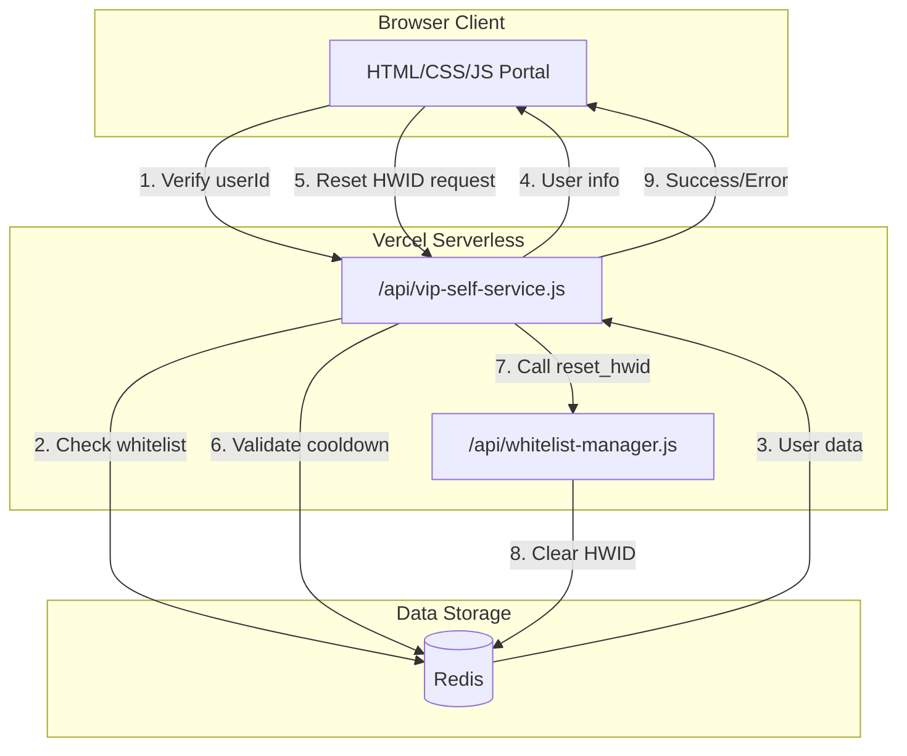
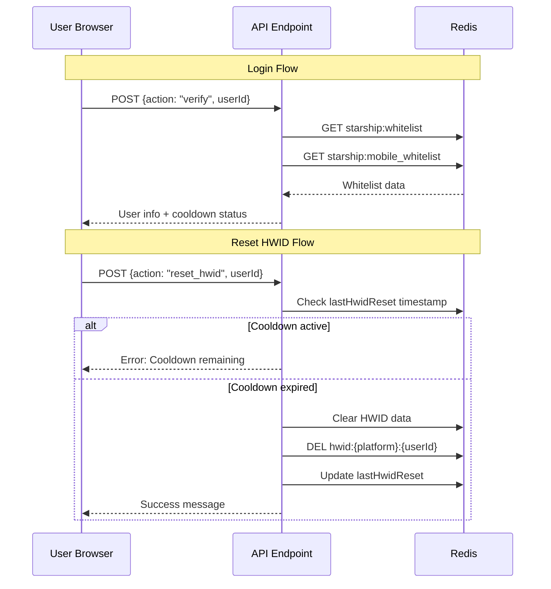

# Design Document: VIP Self-Service HWID Reset Portal

## Overview

Portal self-service berbasis web yang memungkinkan user VIP Starship (PC dan Mobile) untuk melakukan reset HWID secara mandiri. Portal ini menggunakan arsitektur client-server dengan frontend HTML/CSS/JavaScript dan backend API endpoint yang terintegrasi dengan sistem whitelist-manager yang sudah ada.

## Architecture



## Components and Interfaces

### 1. Frontend Component: `public/vip-reset.html`

Single-page HTML file dengan embedded CSS dan JavaScript yang menyediakan:

- Login form dengan input userId
- Display informasi VIP user setelah login
- Tombol reset HWID dengan konfirmasi
- Cooldown timer display
- Error/success message handling

**Interface:**
```javascript
// State management
const state = {
    userId: null,
    userData: null,
    isLoggedIn: false,
    cooldownRemaining: 0
};

// API calls
async function verifyUser(userId) → { success, user, error }
async function resetHwid(userId) → { success, message, error }
```

### 2. Backend Component: `api/vip-self-service.js`

Serverless API endpoint yang menangani:

- User verification tanpa admin credentials
- HWID reset dengan cooldown enforcement
- Integrasi dengan Redis untuk data persistence

**API Endpoints:**

```
POST /api/vip-self-service
Body: { action: "verify", userId: "123456" }
Response: { success: true, user: {...}, platform: "pc"|"mobile" }

POST /api/vip-self-service
Body: { action: "reset_hwid", userId: "123456" }
Response: { success: true, message: "HWID berhasil direset" }
```

### 3. Data Flow



## Data Models

### User Whitelist Entry (existing structure)
```javascript
{
    userId: "9268011358",
    username: "PlayerName",
    type: "VIP" | "MOBILE_VIP" | "owner",
    status: "active" | "suspended" | "expired",
    addedAt: "2024-12-14T11:05:00Z",
    expiresAt: "2025-12-14T11:05:00Z" | null,
    hwid: "abc123..." | null,
    lastHwidReset: "2025-01-10T10:00:00Z" | null,
    hwidHistory: [
        { hwid: "old-hwid", resetAt: "2025-01-09T10:00:00Z" }
    ],
    restrictions: {
        maxDevices: 5,
        ipTracking: true,
        webhookNotify: true
    },
    platform: "pc" | "mobile"
}
```

### API Response Models

```javascript
// Verify Response
{
    success: true,
    user: {
        userId: "123456",
        username: "PlayerName",
        type: "VIP",
        status: "active",
        platform: "pc",
        expiresAt: "2025-12-14T11:05:00Z",
        hasHwid: true,
        lastHwidReset: "2025-01-10T10:00:00Z",
        cooldownRemaining: 0 // seconds
    }
}

// Error Response
{
    success: false,
    error: "User ID tidak terdaftar sebagai VIP"
}
```


## Correctness Properties

*A property is a characteristic or behavior that should hold true across all valid executions of a system—essentially, a formal statement about what the system should do. Properties serve as the bridge between human-readable specifications and machine-verifiable correctness guarantees.*

### Property 1: User Verification Correctness

*For any* userId, the verification endpoint SHALL return user data with platform information if the userId exists in either PC or Mobile whitelist, OR return an error message "User ID tidak terdaftar sebagai VIP" if the userId does not exist in any whitelist.

**Validates: Requirements 1.1, 1.3**

### Property 2: Active Status Enforcement

*For any* userId that exists in the whitelist, the verification endpoint SHALL only return success if the user status is "active". For users with status "suspended" or "expired", the endpoint SHALL return an error indicating the account status.

**Validates: Requirements 1.2, 1.4**

### Property 3: User Data Completeness

*For any* successful verification response, the returned user object SHALL contain all required fields: userId, username, type, status, platform, expiresAt (or null for lifetime), hasHwid, lastHwidReset, and cooldownRemaining.

**Validates: Requirements 1.5, 2.1, 2.2, 2.3, 2.4, 2.5**

### Property 4: Cooldown Enforcement

*For any* HWID reset attempt, if the time since lastHwidReset is less than 1 hour, the reset SHALL be rejected with the remaining cooldown time in seconds. If the time since lastHwidReset is 1 hour or more (or lastHwidReset is null), the reset SHALL be allowed.

**Validates: Requirements 4.1, 4.2, 4.3, 4.4**

### Property 5: Reset State Consistency

*For any* successful HWID reset, the user's HWID field SHALL be set to null, the lastHwidReset timestamp SHALL be updated to the current time, and the previous HWID SHALL be added to hwidHistory.

**Validates: Requirements 3.3, 3.5**

## Error Handling

### Error Categories

| Error Code | Message (ID) | Condition |
|------------|--------------|-----------|
| `USER_NOT_FOUND` | "User ID tidak terdaftar sebagai VIP" | userId not in any whitelist |
| `USER_SUSPENDED` | "Akun Anda sedang di-suspend" | user.status === "suspended" |
| `USER_EXPIRED` | "VIP Anda sudah expired" | user.status === "expired" or expiresAt < now |
| `COOLDOWN_ACTIVE` | "Tunggu {X} menit {Y} detik untuk reset lagi" | lastHwidReset + 1h > now |
| `RESET_FAILED` | "Gagal mereset HWID, coba lagi nanti" | Redis/API error |
| `INVALID_ACTION` | "Action tidak valid" | Unknown action parameter |

### Error Response Format

```javascript
{
    success: false,
    error: "USER_NOT_FOUND",
    message: "User ID tidak terdaftar sebagai VIP",
    details: {} // optional additional info
}
```

## Testing Strategy

### Unit Tests

Unit tests akan fokus pada:
- Parsing dan validasi input userId
- Kalkulasi cooldown time
- Format response API
- Error message generation

### Property-Based Tests

Property-based tests menggunakan **fast-check** library untuk JavaScript:

1. **User Verification Property Test**
   - Generate random userIds (existing and non-existing)
   - Verify correct response based on whitelist membership

2. **Cooldown Enforcement Property Test**
   - Generate random timestamps for lastHwidReset
   - Verify cooldown calculation is correct for all time differences

3. **Reset State Consistency Property Test**
   - Generate random user states
   - Verify HWID is cleared and history is updated after reset

### Test Configuration

```javascript
// fast-check configuration
fc.configureGlobal({
    numRuns: 100, // Minimum 100 iterations per property
    verbose: true
});
```

Each property test MUST be annotated with:
```javascript
// Feature: vip-hwid-reset, Property 1: User Verification Correctness
// Validates: Requirements 1.1, 1.3
```

## UI/UX Design

### Color Scheme (consistent with existing Starship branding)

```css
:root {
    --primary: #667eea;
    --secondary: #8b5cf6;
    --success: #22c55e;
    --warning: #f59e0b;
    --danger: #ef4444;
    --bg-dark: #0f0f1a;
    --bg-card: #1a1a2e;
}
```

### Page States

1. **Login State**: Form input userId dengan tombol "Verifikasi"
2. **Loading State**: Spinner dengan text "Memverifikasi..."
3. **Logged In State**: Display user info + tombol reset HWID
4. **Cooldown State**: Tombol disabled + countdown timer
5. **Success State**: Success message setelah reset
6. **Error State**: Error message dengan opsi retry

### Responsive Design

- Mobile-first approach
- Max-width: 450px untuk card utama
- Touch-friendly button sizes (min 44px height)
